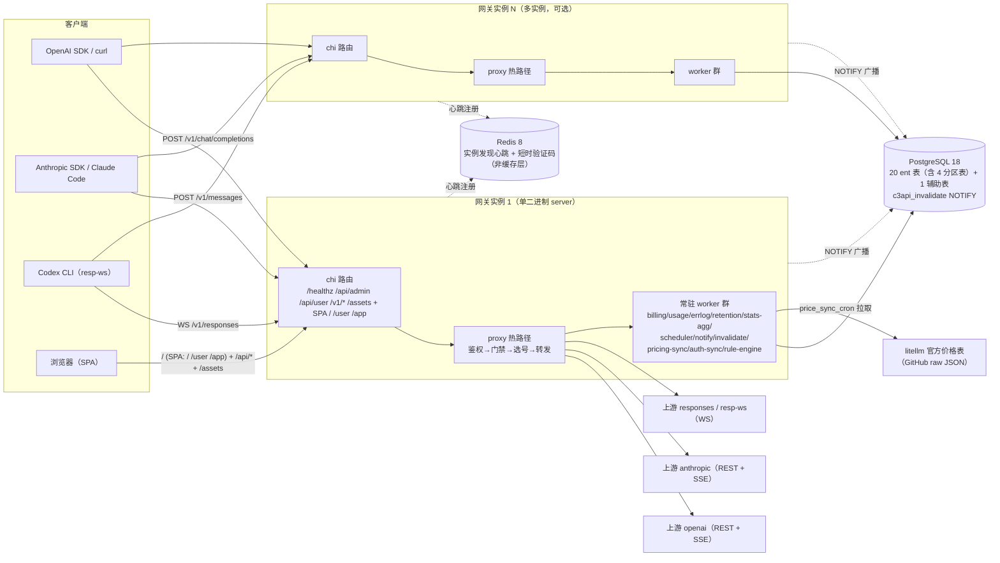
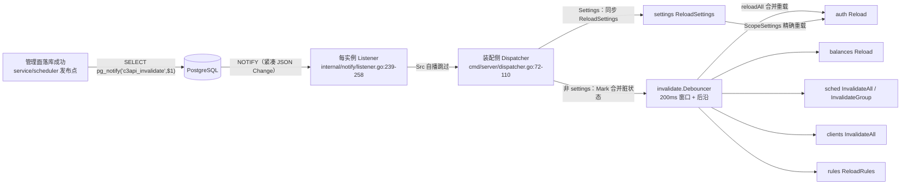

# github.com/is7qin/c3api 架构拓扑（标准文档）

> 受众：vibecoding agent（改热路径/加表/加 worker/接线前必读）+ 新贡献者 onboarding。
> 基准：main HEAD `14191f4`（2026-09-23）。**锚点为尽力而为快照**——本文件随代码漂移，改代码位置时同步更新 file:line（§15.9）；未逐条复核的行号请以符号名为准（行号可能偏移，符号名与包路径已复核）。
> 约定：本文档只陈述 main 现状；快照注册表已合并，§7/§9 按合并后现状陈述。
> 详细 API 契约见 `docs/admin-api.md` 与 `openapi/openapi.yaml`，本文不重复。

## 1. 系统概览

- **双必需依赖**：PostgreSQL 18（全部持久状态）+ **Redis 8**（实例发现心跳 + 短时验证码，**不是缓存层**）。Redis 缺席不是降级而是功能缺失：集群实例数 N 由心跳活体数推导（§10），并发份额与额度分摊都依赖它。

- 单二进制部署：前端 `web/` 构建产物经 `cmd/server/embed.go:14` 的 `go:embed all:dist` 内嵌进 Go 二进制；运行时 = `server` 进程 + 挂载 config（Dockerfile 三阶段：node → go → alpine 非 root）。
- 部署面（一句话带过）：
  - `compose.yml`：`db`（postgres:18-alpine，数据挂载 ./deploy/data/pg）+ `app`（单容器，`C3API_ADMIN_TOKEN`/`C3API_DB_DSN` 环境变量注入，config 只读挂载自 ./deploy/config.toml）。
  - `Dockerfile`：多阶段构建，`CGO_ENABLED=0` 静态单二进制。
  - `scripts/build.sh`：pnpm 构建 web → 拷入 `cmd/server/dist` → `go build -o bin/server`。
  - `tools/`：`tools/loadtest`（打压测，-mode stream/fill，交错跑 + 每请求 CPU）、`tools/fakeupstream`（假上游，chunks/latency 可配）、`tools/e2e`（端到端计费测试）。
- 运维观测面：/api/admin/ops/workers、/api/admin/overview、/api/admin/users-top 收敛进 handler 包（`internal/handler/ops.go:75`、`overview.go:26`、`users_top.go:20`），worker 观测聚合在 `cmd/server/main.go:570-609`；`internal/server` 已纯通用装配（Options 注入 AdminHandler/UserHandler/AIHandler/WebFS，`internal/server/server.go:25-36`）。

## 2. 模块地图

`internal/` 每包一行职责 + 依赖方向。**禁止反向**的约束单独标注。

| 包 | 职责 | 依赖（被谁依赖） |
|---|---|---|
| `internal/config` | TOML 加载 + env 覆盖（`C3API_*`） | main 入口 |
| `internal/server` | 纯通用装配：/healthz、/api/admin 鉴权中间件、/api/user 分流、AI 组、SPA fallback（业务 handler 由 Options 注入）。**AI 组是 `Handle("/v1/*")` 而非 `Mount("/")`**——通配挂载会吞掉 SPA 深链与未匹配路径（`internal/server/server.go:89-101` 注释），/api/admin 亦用 `Handle` 避开 chi v5.3.1 重复 Mount panic | main |
| `internal/handler`（+`/user`） | 管理面 API（openapi 生成，含 ops/overview/users-top）+ 用户面 API | 依赖 service/repository |
| `internal/service` | 业务层：settings/pricing 快照、变更发布 `publish` | 依赖 repository/notify/invalidate/rule |
| `internal/repository` | ent 持久化门面，只暴露 domain 类型（`internal/repository/repository.go:25`）；分区表 DDL 独占管理 | 被所有上层依赖 |
| `internal/domain` | 域类型 + 格式/错误分类常量（六格式 `types.go:22-37`） | 各处 |
| `internal/ent` | ent ORM 生成代码 + schema（20 文件） | repository |
| `internal/proxy` | **请求热路径**：鉴权/门禁/选号/转发/用量路由 | 依赖 scheduler/rule/auth/credential/billing/usage/sdkbridge/protoconv |
| `internal/scheduler` | 账号调度：不可变 RoutingView 快照 + RoutingCompiler 编译道 + 质量/事故观测 + 并发槽 + 跨实例并发共识（`concsync.go`） | 依赖 rule/credential；**不 import notify**（发布面接口化，`cmd/server/dispatcher.go` 装配侧粘合） |
| `internal/discovery` | **Redis 实例发现**：心跳注册/续约/缩容 + 活体实例数 N（`ClusterInstances()`，proxy/scheduler 的 `InstancesProvider` 唯一实现） | main 装配 → proxy/scheduler |
| `internal/quality` | 路由质量观测：Recorder 内存归并 + `quality-sync` worker 落实例分钟表 | main 装配；scheduler 消费 |
| `internal/rule` | 规则引擎：事件队列 worker（Name="rule-engine"）+ 状态动作 apply | scheduler 注入 apply 回调 |
| `internal/credential` | 凭据类型注册表 + Provider 分发（api_key/responses-special/codex-oauth/codex-pat，`internal/credential/credential.go:24-33`） | proxy/scheduler 消费 |
| `internal/auth` | JWT issuer/verify + RequireJWT 中间件 | server/user handler |
| `internal/billing` | 计费：价格矩阵纯函数、余额快照、批量扣费 Flusher | proxy/repository |
| `internal/usage` | 明细 Recorder、err_logs 落盘 worker、retention worker、**stats-agg 离线聚合 worker** | proxy/billing/repository |
| `internal/notify` | 多实例 NOTIFY 发布/监听（`Change` 载荷 + Dispatcher 接口） | main 装配（service/scheduler 发布） |
| `internal/invalidate` | 管理面变更去抖定向失效（Debouncer） | main 装配；service 作 Invalidator |
| `internal/pricing` | litellm 价格表拉取 + cron 同步 worker（落 `price_entries` + `price_variants` 双表；换算系 ×1e5 与 ×1e11 **禁混用**） | service/repository |
| `internal/protoconv` | 协议转换（四方向，纯标准库） | proxy（convertedCaller） |
| `internal/worker` | worker.Worker 契约 + Manager（顺序启动/反向排空/panic 栈日志/Go 托管） | cmd/server 装配 |
| `internal/snapshot` | 快照注册表（已合并）：Registry/ReloadAll/Status + scope 精确分发 | cmd/server 装配（dispatcher 消费） |
| `internal/sdkbridge` | codex-sdk 适配层（生图/Responses/Stream/WS/Search/Dial + 凭据派生 clientFor + 失效回调 + OAuth 轮转回写，`internal/sdkbridge/codex.go:27`） | proxy |
| `pkg/aiclient` | openai/anthropic SDK 客户端懒构建工厂（**非唯一引用点**——proxy 各 caller 直接 import SDK 类型，第三 SDK codex-sdk 经 sdkbridge） | proxy |
| `pkg/httpx` | 共享上游 http.Transport（连接池参数；Proxy 默认 nil 直连） | main → aiclient/sdkbridge/pricing |
| `pkg/sserelay` | 字节级 SSE relay（帧原样透传 + Observer 旁路 + Mapper 挂载） | proxy 流式路径 |
| `pkg/redisx` | Redis 客户端（连接/哨兵/重连；**非缓存层**——只服务实例发现心跳与短时验证码） | main → discovery/proxy/scheduler |
| `pkg/cryptox` / `pkg/logx` | 客户端 key 生成（ck- 前缀随机 hex，明文落库，见 key_raw 设计） / 结构化日志 | 各处 |

装配链（`cmd/server/main.go` main 函数，现 803 行）：config → logx → `-pprof` 监听（`:92-93`，失败 Warn 不 fatal）→ PG 池（`OpenPG` + `stdlib.OpenDBFromPool` 桥接，`:126`）→ **四分区 bootstrap**（`:146,149,152,155`：usage_logs / err_logs / usage_stats / usage_entity_stats）→ codex-search 价格种子（`EnsureCodexSearchSeed` `:164`）→ notify Publisher（`:180`）→ **discovery**（`:184`，Redis 心跳，提供实例数 N）→ statsAgg/errlogW/retention（`:222-237`）→ proxy.Auth（`:243`）→ invalidate Debouncer（`:301`）→ service（`:335`）+ mailW（`:334`）→ **snapReg 注册**（`:354-366`）→ dispatcher（`:372`）→ notify listener（`:380`）→ authSync（`:389`）→ billing Flusher（`:403`，构造参数一次注入，禁事后回填）→ **codexAdapter**（`:437`）→ quality Recorder（`:464`）→ proxy.New（`:468`）→ `SetInstancesProvider(disco)`（`:500,503`——gate 与 scheduler 同一 N 源）→ concSync/accConcSync（`:508,512`）→ pricing SyncWorker（`:521`）→ qualitySync（`:546`）→ opsWorkers 观测聚合（`:570-609`）→ handler.New（`:608`）→ server.NewServer（`:628`）→ **snapReg.ReloadAll 统一首刷**（`:651`，全成功置位 bootLoaded）→ worker.Manager 注册 + StartAll（`:671-685`）→ HTTP 监听（`:698-723`）→ 优雅停机链（`:734-756`）。

依赖约束（改代码前先看）：
- **notify 不 import invalidate/service**（`internal/notify/listener.go:15-16`）；**scheduler 不 import notify**（`cmd/server/dispatcher.go:17-25`）——跨层发布全部接口化，由 cmd/server 装配侧粘合。
- **proxy 不 import server/handler**；handler 不 import proxy（AI 端点经 `proxy.AIRouter` 在 main 装配）。
- **repository 不依赖任何业务包**（domain 类型下沉）。
- ent schema 文件名 snake_case 对照（勿混淆）：`internal/ent/schema/account_ext.go`↔包 `accountext`、`group_assignment.go`↔`groupassignment`、`template_ext.go`↔`templateext`、`redemption_code.go`↔`redemptioncode`、`redemption_use.go`↔`redemptionuse`、`temp_balance.go`↔`tempbalance`、`usagelog.go`↔`usagelog`、`usagestat.go`↔`usagestat`、`usageentitystat.go`↔`usageentitystat`、`errlog.go`↔`errlog`、`priceentry.go`↔`priceentry`、`pricevariant.go`↔`pricevariant`、`emailtemplate.go`↔`emailtemplate`（`internal/ent/schema/` 共 20 个文件）。

## 3. 请求热路径

**入口**：`internal/server/server.go:89-101` AI 组 `Handle("/v1/*")`（inflightLimiter :90；**非 `Mount("/")`**）→ `internal/proxy/router.go:19-57` 路径决定格式（**8 端点**：chat/completions、responses×2（HTTP+WS）、messages、images generations/edits、alpha/search、models；responses 带 upgrade 头 → WS 编排 `internal/proxy/caller_responses_ws.go`）。

**骨架**（`internal/proxy/pipeline.go:43` `guardPipeline` + `internal/proxy/caller.go:126` `handleFormat`，顺序即纪律）：

```mermaid
flowchart LR
    A["Authenticate<br/>internal/proxy/auth.go:146"] --> B["QuotaExhausted<br/>本地预算快读 internal/proxy/gate.go:331"]
    B --> C["余额预检<br/>BalanceOf 快照 internal/proxy/pipeline.go:86"]
    C --> D["Acquire 两级并发门禁<br/>internal/proxy/gate.go"]
    D --> F["读体 + json.Valid +<br/>gjson 提 stream/model/tier"]
    F --> G["sched.Select 选号<br/>（含协议转换补差）"]
    G --> H["failover 循环<br/>每轮缺价预检 + codex 分流<br/>credentialFor + caller.Call"]
    H --> I["finish/record：<br/>Release + DeductQuota +<br/>计费 + routeLog 路由"]
```

每个决策点：
- **鉴权**（`internal/proxy/auth.go:146`）：`Authorization: Bearer` 或 `x-api-key`（Anthropic 口径）→ 快照按明文等值查（零 DB）；key 或归属用户禁用 → 401 即时失效。
- **认证双路径**（`internal/server/middleware.go:49` adminAuth + `internal/server/server.go:71-82` /api/admin 组 Handle）：/api/admin 组 = 静态 admin token `Bearer <AdminToken>` **OR** platform_admin JWT（`JWTIssuer.Verify` + `claims.Role==platform_admin` + 快照用户状态 active 校验；JWT 路径注入 `adminUserIDKey`）；/api/user 组 = 内部公开分流（`internal/handler/user/router.go:24-52`：register/login/register-code/forgot-password/reset-password 公开，其余 RequireJWT）；AI 组 = key 鉴权（无 JWT）。
- **配额**：`quotaExhausted`（`internal/proxy/gate.go:331`）本地预算两原子读；耗尽才触发 DB 复核认领（`reclaim` `internal/proxy/gate.go:384`，慢路径单飞 + 10s 失败退避）；复核公式 `budget = consumed + ceil(remaining_eff/N)`（`allocBudget` `gate.go:439`；收敛修正，防复核无限续额）。
- **余额预检**（`internal/proxy/pipeline.go:86-91`）：BillingCapture 门控快照读零 DB（滞后 ≤ balance_refresh_interval）；快照缺失/<0 且非免费组 → 402（余额 0 放行——临时额度由 FEFO 扣费消化）；免费组（EffectiveMultiplier==0）放行。
- **并发门禁**：user → key 两级 CAS（`internal/proxy/gate.go:282-291`），key 失败回滚 user 计数；跨 reload 在途值继承。
- **拒绝与退避**：key/user 两级并发门禁；账号 `max_concurrency` 归 scheduler；429 冷却与错误退避由规则引擎（种子 + `/api/admin/rules` 自定义）接管。
- **选号**：`internal/scheduler/selection.go` + `attempt_plan*.go` 执行后台 RoutingCompiler 预编译的不可变计划（Primary/Degraded 按编译序、Explore 按累计权重 + 完整 fallback tail），逐项 RuntimeHealth 有效态 + 并发 CAS 准入；`AttemptPlan` 固定 [8] attempted-ID 集跨账号去重（failover_attempts 1..8）。请求路径零质量计算/零排序/零分配/零远程访问；协议转换只补差（`internal/proxy/caller.go:47` `convertedRoute`，off 零开销）。
- **缺价预检**：failover 循环内每轮调用 `precheckPrice`（`internal/proxy/caller.go:417`）——images 查 `price_entries` 的 image 分量、其余查 token 分量，缺价 402 释放槽。
- **codex 分流**（`internal/proxy/caller.go:344-358`）：按 `sel.CredentialType` 换 codexImagesCaller（:353 codex 类型跳单字符串凭据走 sel.Ext → AccountCredential 直供适配层）。
- **流式透传**：aiclient 流式入口经 `pkg/sserelay` 字节级 relay + Observer 旁路提取 usage；批次能力：EOF 末帧 flush（无末尾空行上游丢 completed 帧 → cost=0 修复）、deadline watcher、normalize 错误分类（三态可分）、relayBufio 池、按需武装 flush timer（均见 `pkg/sserelay/relay.go`）；WS 1:1 透传（`internal/proxy/ws_relay.go:54`）。
- **usage 计费**：`finish`（`internal/proxy/forward.go:189`）→ `routeLog`（`forward.go:420`）分表路由——放行行（error_type ∈ {none, abort}）billed → Flusher / 非 billed → rec.Record；拒绝路径走 `recordRejected`（`forward.go:375`——401/429/402 → err_logs 不进 usage_logs）；images/search 按次计费 `applyImageBilling`/`applyFunctionBilling`（`forward.go:266,293`，call_count）。

**热路径纪律**（改这里先读）：
1. 热路径**零 DB、零 per-request 锁**（`internal/proxy/forward.go:5` 包注释）；所有快照读 = 内存原子（atomic.Pointer / RWMutex 读锁 / CAS）。
2. **开关关闭 = 快照读 + 分支**：`protocol_convert=off` 不触达 protoconv（`internal/proxy/caller.go:244-260`）、`strip_image_tools` 关 = 布尔读 + 分支（`internal/proxy/caller_responses.go:37`、`internal/proxy/usage_extract.go:293`）、billing off = `BillingCapture` 恒 false（跳过余额预检 + billable 行出生即 `billed=true` 吸收态，`internal/proxy/forward.go:42` 注释——单写点后不再路由分流）。
3. **开关开启 = bytes.Contains 预筛零解析**：图像 tool 剥离 `internal/proxy/strip_scan.go` 预筛（无 "image" 子串零解析，压测 ~1.5% QPS 差异）；转换走 gjson 预筛 + Raw 零拷贝（`internal/protoconv/jsraw.go:7-11`）。
4. **永不阻塞投递**：usage.Record（`internal/usage/usage.go:157`）为无 channel 的锁内归并；**billing 已无内存 pending 队列**——改为账本游标消费（`usage_logs` 的 `billed=false` 行即队列，DB 即队列）；errlog 投递 select-default 非阻塞丢弃（`internal/usage/errlog.go:169-171`）。

## 4. 协议适配面

六格式（`internal/domain/types.go:22-37`）：`openai-chat` / `openai-responses` / `openai-responses-ws` / `anthropic` / `openai-images`（generations/edits 双端点）/ `openai-search`（按次计费）。

| 格式 | 入口 | caller | 流式 |
|---|---|---|---|
| chat | `POST /v1/chat/completions` | `internal/proxy/caller_chat.go` | SSE relay |
| responses | `POST /v1/responses` | `internal/proxy/caller_responses.go` | SSE relay |
| responses-ws | `WS /v1/responses`（upgrade 头判定，`internal/proxy/router.go:19-57`） | `internal/proxy/caller_responses_ws.go` | 原生 WS 1:1 |
| anthropic | `POST /v1/messages` | `internal/proxy/caller_anthropic.go` | SSE relay |
| images | `POST /v1/images/generations` / `/edits` | `internal/proxy/caller_images.go`（双调用器，注册表 `forward.go:76-80,151-152`）+ codex 变体 `caller_images_codex.go`/`caller_images_stream.go` | SSE relay |
| search | `POST /v1/alpha/search` | `internal/proxy/forward_search.go:111`（独立编排：独立选号 + 四类型分派 + 按次计费） | unary |

pkg 职责边界：
- `pkg/aiclient`（`pkg/aiclient/aiclient.go:5-13`）：**openai/anthropic 官方 SDK 客户端懒构建工厂**——鉴权头注入（格式决定头名：openai → `Authorization: Bearer`、anthropic → `x-api-key`）+ typed 面非流式超时（UpstreamTimeout）；**非唯一引用点**——proxy 各 caller 直接 import openai-go/anthropic-sdk 类型（`caller_chat.go`、`caller_anthropic.go`、`caller_responses.go`、`caller_converted.go`），第三 SDK codex-sdk 经 sdkbridge 适配。
- `internal/sdkbridge`（`internal/sdkbridge/codex.go:27`）：**codex-sdk 唯一适配层**——GenerateImage/GenerateImageStream/Responses/StreamResponses/Search/Dial + 凭据派生 clientFor + 失效回调 + 轮转回写 WriteOAuthRotation；codex 非流式超时各自包 ctx WithTimeout（`codex_responses_http.go:90-92`、`caller_images_codex.go:107-112`——HTTPClient.Timeout 不可用，流式/非流式四方法共享，`forward.go:38` 注释）。
- `pkg/httpx`：共享 `http.Transport`（连接池参数：max_idle_conns 8192、per_host 2048、force_http2、idle_conn_timeout 90s、dial_timeout 10s，`config.example.toml`）；openai-go/anthropic-sdk 共用同一 `*http.Client`（`cmd/server/main.go:244`）；**codex SDK 另有独立 transport**（`main.go:443`：httpx 网关同形态 + MaxConnsPerHost 显式上界，补压测修复 MaxIdleConnsPerHost=2 连接风暴）；**httpx.Proxy 默认 nil 直连**（`pkg/httpx/httpx.go:24-28,33`——不再隐式 ProxyFromEnvironment 防 HTTP_PROXY 静默改道）。
- `pkg/sserelay`：字节级 SSE relay——增量读帧原样转发 + 自适应批量 Flush + Observer 旁路（仅 usage 提取，不参与转发决策；`pkg/sserelay/relay.go:5-7`）+ EOF 末帧 flush + deadline watcher + normalize 错误分类 + relayBufio 池 + **Mapper 挂载**（转换，`relay.go:89-93`，Observer 仍见原始帧）。
- 凭据抽象 `internal/credential`：Provider 只返回凭据值，不感知请求格式（`internal/credential/credential.go:9-11` 正交原则）；未知类型显式报错不静默 fallback（`internal/proxy/forward.go:748` credentialFor）；**codex 复合凭据不进注册表**——走 `sel.Ext` → AccountCredential 直供适配层（`caller.go:344-358` 注释，单字符串表达不了）。

加新格式 = 1 个 caller 文件 + `internal/proxy/forward.go:76-80,151-152` 注册表一行（callers + convCallers 四方向 + images/codexImages 双调用器）+ router.go 一个端点（现 8 端点，`router.go:19-57`）；images 同格式双端点 + codex 双调用器为既有格局之外的特例。

## 5. 协议转换层（internal/protoconv）

- 边界（`internal/protoconv/protoconv.go:5-13` 包注释）：**纯标准库**（encoding/json），与 OpenAI/Anthropic SDK 零耦合；按 `groups.protocol_convert` 快照值分派（off 不经过本包——热路径分支在 proxy 判定）；WS 帧流转换不做（resp-ws 1:1 透传）。
- 四方向（`internal/protoconv/protoconv.go:29`）：`ConvertRequest`（chat→resp / mess→resp / resp→mess / chat→mess）+ `ConvertResponse`（非流式）；`NewStreamMapper`（流式 SSE 事件映射，`internal/protoconv/protoconv.go:62`）；四方向常量在 `domain/types.go:627-631`。
- **字节级纪律**（`internal/protoconv/jsraw.go:20-25`）：gjson 预筛（`gjsonKeyEq` 长度校验 + 逐字节比较零分配）→ `gjson.Result.Raw` 零拷贝切片直接拼入输出 → 单缓冲复用（`StreamMapper` 的 buf/dbuf，`internal/protoconv/protoconv.go:84`；帧返回后下一帧覆盖，调用方不得跨帧保留）；chat→resp 方向字节级组装，其余方向 map 组装（`EncodeFrame`）。
- 缺名帧处理（教训）：无 `event:` 名帧从 data 的 `type` 字段推断（**已上提到共享实现** `pkg/sserelay/relay.go:46` `InferEventName`，protoconv 在 `internal/protoconv/protoconv.go:120` 调用），无法推断原样透传。
- 转换 on/off 开销实证（`docs/superpowers/plans/2026-08-11-w3-loadtest.md` §二 与 `docs/superpowers/plans/2026-08-11-protoconv-opt-loadtest.md` §一，均压测机（内部环境，IP 存部署清单） 实证）：
  - w3 历史：on 相对 off = QPS **-16.4%**、每请求 CPU **+32%**（+71.5µs）、首字节 **+34ms**。
  - 字节级优化后（请求 274→6 allocs、流式逐帧 59→1.1 的 benchmark 声明）：QPS 差距收敛至 **-10.9%**（52.3k→46.6k）、CPU **+17.8%**（+41.4µs）、首字节 **+21ms**；pprof 转换路径占比 22.6% → 8.5%。
  - off 基线无回退（52.3k / 232.8µs，与 w3 off 同量级）——"off 热路径零开销"保持成立。

## 6. 数据模型

**20 张 ent 表**（`internal/ent/schema/` 20 个文件；ent migrate 清单 21 张 = 17 普通 + 4 分区，`internal/ent/migrate/schema.go:671-693`；另非 ent 辅助表 `stats_agg_watermark`，**总账 22 张**）：

| 表 | schema 文件 | 说明 |
|---|---|---|
| accounts | account.go | 上游账号（enabled/failed_at/failure_source/lifecycle_revision/identity_revision/upstream_cost_multiplier_bp/cache_domain/max_concurrency + template_id；生命周期两轴正交，两个代际 C/K 的分工见 admin-api「生命周期模型」） |
| account_exts | account_ext.go | 账号类型化扩展（codex oauth/pat 凭据；`(codex_email, codex_account_id)` 组合幂等键） |
| email_templates | emailtemplate.go | 邮件模板覆盖（purpose/subject/body_text；缺行回退内置默认） |
| groups | group.go | 组（倍率、protocol_convert、key 限制） |
| group_assignments | group_assignment.go | 用户-组关联（专属倍率） |
| keys | key.go | 网关 key（key_raw/quota/quota_used/max_concurrency） |
| **price_entries** | priceentry.go | 模型价格主表（model 唯一 + `mode` token/call/image + 各分量毫分列 + source 行级互斥 manual > litellm） |
| price_variants | pricevariant.go | 条件价格变体（seq 升序首中即停；`mult_bp` 整单倍率或绝对覆盖列） |
| redemption_codes / redemption_uses | redemption_code.go / redemption_use.go | 兑换码 + 使用记录（`(code_id,user_id)` 唯一 + user_id 前缀索引；90 天 TTL 有界批删 ≤5000 行/轮，`internal/usage/retention.go` + `internal/repository/partition.go`） |
| rules | rule.go | 规则引擎表（种子 + 自定义） |
| settings | setting.go | 内置设置注册表（`internal/domain/settings.go:13-45` 类型化 key） |
| temp_balances | temp_balance.go | 临时额度（FEFO 扣费） |
| templates / template_exts | template.go / template_ext.go | 模板 + 类型化扩展（strip_image_tools 等开关） |
| users | user.go | 用户（balance/balance_warning_threshold/token_version/status/max_concurrency） |
| **usage_logs** | usagelog.go | 计费明细（**分区表**；瘦身——无 status_code/error_message；含价格快照 `Price*Millis` + `billed` 出生定态列） |
| **err_logs** | errlog.go | 错误审计明细（**分区表**；status_code integer + error_message） |
| **usage_stats** | usagestat.go | 分组×模型小时桶聚合（**分区表**） |
| **usage_entity_stats** | usageentitystat.go | 实体（account/user/key）×模型小时桶卷积（**分区表**；服务 `/stats/entity-trend` 与 `/stats/top`） |

另：`accounts`↔`groups` 多对多隐式 join 表 `account_groups`（`internal/ent/account/account.go:67`）。价格面为 `price_entries`（每模型一行，`mode` 声明主计费方式）+ `price_variants`（条件变体，seq 升序首中即停）双表。

**四表分区**（`internal/repository/partition.go`，单一实现四表共用）：
- 分区键：usage_logs/err_logs = `created_at`；usage_stats/usage_entity_stats = `bucket_time`（小时桶 24 桶/日分区）。主键 `(id, 分区键)`（分区表硬约束），id 走专用序列 `{table}_id_seq`，DROP TABLE 级联回收（`internal/repository/partition.go:83-91` `partitionCol`）。
- 保留期：usage_logs **30 天**、err_logs **7 天**（错误审计短保留）、usage_stats / usage_entity_stats **180 天**（聚合长保留，两表共用 `StatsRetentionDays`）——**全部 DROP 分区 O(1)**（PG DELETE 不释放空间，用户裁决），retention worker 每小时巡检按名 DROP + 预建当日/明日分区。
- ent migrate 跳过分区表（`migrateHookExcludesPartitioned` `internal/repository/partition.go:660-676`——atlas 对分区表 diff 规划期必失败，真实 PG 实测结论）；表 DDL/索引由 bootstrap 独占管理（`ensureTablePartitioned` 族 `partition.go:469-503,566-571`：未分区 → DROP 重建表/序列/OWNED BY/索引，已分区 → 仅补当日/明日分区；幂等 + 42P07/42710/23505/42P01 容忍多实例并发）；**无补列路径**——表恒从零创建，schema 变更即全新建库（多实例并发 bootstrap 竞态由 `isBootstrapRaceError` `partition.go:404-416` 容忍）。
- 关键索引（`internal/repository/partition.go:158-173`）：usage_logs `(created_at)` + `(group_id/account_id/user_id/key_id, created_at)` + **`usagelog_request_id_created_at` 唯一索引**（幂等键）+ **`usagelog_unbilled_id` 部分索引**（`WHERE NOT billed`——结算游标取批）；err_logs `(created_at)` + `(group_id/user_id, created_at)`；usage_stats 唯一索引 `(bucket_time, group_id, model)`（Upsert 冲突目标）；usage_entity_stats 唯一索引 `(bucket_time, entity_type, entity_id, model)` + 覆盖索引 `(entity_type, entity_id, bucket_time)`。
- **stats_agg_watermark 辅助表**（`partition.go:481-491` DDL + `EnsureUsageStatsPartitioned` 内建）：单行 watermark（`CHECK (id = 1)`）——stats-agg worker 每周期读聚合位置、推进与 DELETE+INSERT 同事务。

**金额单位（两个面，勿混）**：
- **明细/计数面恒为毫分整数**（1 USD = 100,000 毫分）——`usage_logs.cost` / `raw_cost`、`price_*_millis` 价格快照列（每 M token 毫分）、`keys.quota` / `quota_used`、routing frontier 的 `cost_per_success`；API 边界**原样下发不换算**。
- **聚合/账户面恒为 USD float64**——`users.balance` / `balance_warning_threshold`、`temp_balances.amount`、兑换码 `value`、`/stats/*` 与 `/overview` 的 cost 族；由 handler 按 `毫分 / 1e5` 换算（单一换算点 `internal/handler/convert.go:215` `millisToUSD`，反向 `:219` `usdToMillis`）。
- 换算系三处并存、**禁混用**：余额/成本 `×1e5`（毫分）；token 单价 `×1e11`（毫分/1M token，即 USD/token × 1e6 × 1e5）；出参 `/1e5`。

**key 额度语义**（`internal/repository/key_repo.go` + `internal/service/key.go`）：
- `quota` / `quota_used` 均毫分 int64；`quota = 0` = **不限**（此时 `quota_used` 恒 0）；上限 `9007199254740991`（2^53−1 = JS `Number.MAX_SAFE_INTEGER`，按 UI 承载能力裁定；越界 → 400，`internal/service/key.go:25`）。
- **`quota` 显式设为 `0` 会在同一 UPDATE 内清零 `quota_used`**（`key_repo.go:192-204`）——不限额度下"已用"无意义（否则 UI 显示"已用 $X / 不限"），且它是**累计**上限，不清零则历史消耗会带进下一次设额。这是 `quota_used` 的唯一服务端写点。
- 增量回写 `AddQuotaUsed` 带 `WHERE "quota" > 0` 守卫（`key_repo.go:347-351`）：无额度 key 恒不累计，同时封死"额度刚被清零、本实例或他实例在途的迟到回写把已用量带回来"的复活路径。

**账号写面的"存在性"语义**（`internal/domain/types.go` + `internal/service/account.go`）：
- `upstream_cost_multiplier_bp` 是 `*int`，读走自由函数 `domain.MultBp(v)`（nil → 10000 = ×1，`types.go:419-425`）——**显式 ×0（免费）与"未提供"可区分**，创建 / PATCH / 批量三面同语义（`internal/service/account.go:54-65`、`internal/handler/convert.go:88`）。`MultBp` 刻意是**自由函数而非方法**：scheduler 的静态读闭包门按 AST 枚举字段选择器，方法调用会隐藏读路径。
- codex 批量导入（`/accounts/batch-import-codex-oauth|pat`）的 `enabled` / `cache_domain` / `upstream_cost_multiplier` 是 **body 级**字段，**仅对本次新建行生效**——命中幂等键的已存在行只更新凭据列，不覆盖这三项配置（`internal/service/ext_codex_import.go`，与 `max_concurrency` 同款"仅创建生效"语义）。

## 7. 快照与注册表层级

**main 现状（已合并）**：快照注册表 `snapshot.Registry`（`internal/snapshot/snapshot.go`：`Register` :161、`ReloadAll` :216、`Reload` :229、`Status` :341）只持有 Name/Scope/LastReload 元数据，**不接管模块 ticker、不缓存快照数据、不进请求热路径**（用户拍板 2026-08-11，包注释）。快照数据形态与周期刷新仍各模块自管（atomic.Pointer 整表换入或 RWMutex + 锁内换 map）：

| 快照 | 实现 | 刷新源 |
|---|---|---|
| auth（key/user 元数据 + gate 计数） | `internal/proxy/auth.go:68` Reload，锁内整体换 | invalidate Users/Keys + authSync 60s 周期兜底 + 启动 ReloadAll |
| scheduler（RoutingView：静态 + 编译决策 + 并发槽） | `internal/scheduler/scheduler.go` atomic.Pointer[RoutingView] 单根（copy-modify-Store） | invalidate 全量/组级 + 30s syncLoop ticker + 静态重载尾部 RequestCompile（200ms 去抖编译道） |
| rules（规则表） | `internal/rule/engine.go:253` Reload（`:368` ReloadRules 别名） | invalidate Rules + 启动 ReloadAll |
| pricing（`price_entries` + `price_variants` 双表） | `internal/service/pricing.go:33` ReloadPricingAndNotifyCompiler + `:59` ReloadPricingCtx | ReloadPricing（sync 成功 / 管理端改价后）+ NOTIFY Pricing → dispatcher 同步 ReloadPricingCtx（settings 同款，跨实例失效） |
| balances（余额 + 倍率） | `internal/billing/balances.go:47`（atomic.Pointer，`Set` :132 原地 Store） | invalidate Users/Multipliers + BalanceRefreshInterval ticker（`internal/billing/flusher.go` `refreshLag`） |
| settings | `internal/service/setting.go:109` ReloadSettings | invalidate Settings + 启动（**自身不进注册表**） |
| credential.Registry | `internal/credential/credential.go`（类型注册表 + Provider 分发，无快照语义） | 静态注册 |

**注册表装配**（`cmd/server/main.go:354-366` + `cmd/server/snapshots.go`）：五路注册 auth/scheduler/rules/pricing/balances（billing 关不注册 balances）；**启动首刷 = ReloadAll 单一入口**（`main.go:651`）。

**启动双刷**：ReloadAll 返回空 errs（全成功）置位 `bootLoaded`（`main.go:655-663`）；dispatcher 首连 `FullRefresh` CAS 消费后**跳过五路 ReloadAll 仅补 ReloadSettings**；部分失败不置位 → 首连仍全量。

**notify.Dispatcher 接口**（`internal/notify/listener.go:26`）：`Apply(Change)` + `FullRefresh()`；实现放装配侧 `cmd/server/dispatcher.go`（notify 不 import invalidate 的依赖环约束）。settings 变更 → 同步 ReloadSettings + 注册表 ScopeSettings 精确重载 auth（预算即时重算）。

## 8. worker 拓扑

统一契约 `worker.Worker`（`internal/worker/worker.go:21-25`：Name/Start/Close 均幂等，Close 未 Start 也安全）；`worker.Manager` 顺序启动、**反向排空**、panic 捕获（`internal/worker/worker.go:30-138`；批次：panic 栈入日志 :127-134、Shutdown 等 Go 托管 goroutine（WaitGroup）:88-116、StartAll 启动期无锁 :57-66、单次生命周期（started atomic.Bool，Register 在 StartAll 后报错）:43-51、Go 托管命名 goroutine :123-138）。

注册顺序与反向排空（`cmd/server/main.go:590-591,671-684`）：`mailW → warningWorker → billingWorker → inv → schedW → ruleEngine → retryWorker → healthW → rec → errlogW → pricingSync → retention → statsAgg → qualityFlowOwner → qualitySync → routingRollup` → `concSync → accConcSync → disco` → `listener, authSync`。停机时**反向**（后注册先关）：listener/authSync 先停接收 → disco（ZREM 自身缩容）→ 并发共识 → 质量/路由 rollup → statsAgg → retention → pricingSync → errlogW → rec → healthW/retryWorker → ruleEngine → schedW → inv → billingWorker（游标扫尾，扣费全量落库）。

| worker | Name | 类型 | 节奏/背压 | 排空/停机语义 |
|---|---|---|---|---|
| billing.Flusher | "billing"（`internal/billing/flusher.go`） | ticker 账本游标消费 | `flush_interval`（250ms）+ `balance_refresh_interval`（10s）；会话级 advisory lock 互斥取批，Balance/FEFO 双车道语句化结算 + 零价标记，无内存 pending 队列 | Close：等在途周期（flushMu）→ 预算内持续消费至游标清空；超时 Cancel baseCtx，未结算行留在 DB 供下次启动续传 |
| usage.Recorder | "usage"（`internal/usage/usage.go`） | 双 loop（`logWriterLoop` :193 + `quotaFlushLoop` :435） | `flush_interval` 500ms / `quota_flush_interval` 10s（统计面为**离线聚合**：stats-agg worker 每周期从明细重算落盘）；swap 换批 + 按 userID 取模分片 N worker；毒丸行止损 **poisonBisect 二分隔离**（隔离行回灌不丢）；flushLogs 与 flushQuota 共用 flushMu | 同 Flusher 模式：等在途 → 预算排空 → 截断 Warn（`Close` :525） |
| usage.StatsAggWorker | "stats-agg"（`internal/usage/stats_agg.go:141`，`Start` :145） | ticker | 每周期单事务 DELETE+INSERT+watermark 重建 usage_stats（:47,152）；advisory lock 防多实例并发；`stats_agg_interval` 默认 5m、0=禁用 | 无资源需排空，Close nil（禁用/正常均安全） |
| usage.ErrLogWorker | "errlog"（`internal/usage/errlog.go:105`） | 双队列 + ticker | 有界队列（reject 4096 / exempt 1024）+ select-default 非阻塞投递（满→丢弃计数，`internal/usage/errlog.go:147,161`）；豁免队列恒落盘；单批 500 行 / 500ms，单批超时 5s 失败即丢弃（`errlog.go:47-49,58,184-190`） | Close：置位 closed（无尾窗口静默丢）→ 等 loop → 预算内排空，超时截断并入丢弃计数（`internal/usage/errlog.go:236-287`） |
| usage.RetentionWorker | "retention"（`internal/usage/retention.go:65`） | ticker 1h | 三表独立 cutoff 各自 DROP + 预建当日/明日；逐表错误隔离（`internal/usage/retention.go:97-148`）；**另含 redemption_uses 90 天 TTL 有界批删**（≤5000 行/轮，普通表无分区可 DROP，`retention.go:32,38,56-58,172` + `partition.go:547`）；启动即巡检 runOnce（:105）；观测面 lastPatrol/lastDrop*（:73-80） | 无排空需求（DROP/预建/批删均幂等），Close 直接 nil（`internal/usage/retention.go:199`） |
| scheduler | "scheduler"（`internal/scheduler/scheduler.go:238`） | syncLoop 单 goroutine（:271）+ 编译道 | sync `sync_interval` 30s；路由编译由 `RequestCompile` 去抖触发（:848-862）；质量/事故观测归 `internal/quality` worker | Close 取消 + 等 goroutine（`Close` :258） |
| **discovery** | "discovery"（`internal/discovery/discovery.go:111`） | ticker 心跳 | Redis 注册/续约活体实例数 N（`ClusterInstances()` :172）；**在业务 worker 之后、listener/authSync 之前注册**（反向排空时 listener 先停接收、discovery 随即 ZREM 自身缩容） | Close：ZREM 自身 + 等 goroutine |
| **proxy.ConcSyncWorker** | "conc-sync"（`internal/proxy/concsync.go:133`） | ticker 500ms | 受限层级在途量跨实例双向同步 → gate 第二快照（clusterView），请求路径零 Redis | Close 取消 + 等 goroutine |
| **scheduler.AccConcSyncWorker** | "account-conc-sync"（`internal/scheduler/concsync.go:122`） | ticker | 账号并发份额 + 借用跨实例共识 | Close 取消 + 等 goroutine |
| **quality.SyncWorker** | "quality-sync"（`internal/quality/sync.go:229`） | 串行 loop | 质量行 UPSERT 进实例分钟表（`routing_quality_instance_minute`）；flow 快照**直写合并层**（`routing_flow_fact`，按 `instance_src` 分片、整分片替换，无下游重算） | Close 取消 |
| **quality.FlowOwner / RollupWorker** | "quality-flow-owner"（`internal/quality/fold_owner.go:112`）/ "routing-rollup"（`internal/quality/rollup.go:97`） | loop / 脏分钟消费 | 实例脏分钟（仅 quality 道）合并进全局 `routing_quality_rollup`，`routing_rollup_watermark` 只剩 quality 一行（flow 无重算故无水位） | Close 取消 |
| notify.Listener | "notify"（`internal/notify/listener.go:123`） | 事件驱动（阻塞 WaitForNotification） | 独立单连接 LISTEN c3api_invalidate；断线指数退避 1s→30s + 重连全量刷新 | Close 取消 + 等 goroutine（阻塞点均响应 ctx，`internal/notify/listener.go:161-175`） |
| invalidate.Debouncer | "invalidate"（`internal/invalidate/invalidate.go:230`） | 事件驱动单 goroutine | 200ms 去抖窗口 + 后沿语义（执行期新变更立即再执行，`invalidate.go:262-302`）；重载串行不重叠；**规则重载 Background ctx 不随请求取消**（:347-354，规则快照无周期兜底，事件驱动全量重载必须无条件完成） | Close nil（停机不补最后 flush——DB 权威，`invalidate.go:249`） |
| pricing.SyncWorker | "pricing-sync"（`internal/pricing/worker.go:81` 构造，`Start` :97） | 启动异步一次 + cron | `price_sync_cron`（默认 `0 3 * * *`）gronx 调度；每轮现读 settings；落 `price_entries` + `price_variants` 双表；非法 cron 1h 重试 | 无资源需排空，Close nil（`Close` :114） |
| cmd/server.authSync | "auth-sync"（`cmd/server/auth_sync.go:38`） | ticker 60s | 周期全量 Reload auth 快照（NOTIFY 丢失兜底，`auth_sync.go:13-16`）；**per-attempt 30s 超时**（:26,80-84，DB 挂起不卡死循环）+ **托管 goroutine**（:57,70，panic 不崩进程）+ 观测面 running/lastReload/failures/lastFailure（:44-48，失败不前移 lastReload :93） | Close nil（循环随 ctx 退出，`auth_sync.go:64`） |
| rule.RuleEngine | "rule-engine"（`internal/rule/worker.go:15`） | 事件队列 | 有界 channel 满则丢弃（dropped 计数 + **阈值告警边沿回落**——每风暴恰好一次，`worker.go:103-122`；resetDropWarnIfDrained :71-75） | Flush 同步排空（测试/优雅关闭用，`worker.go:52-64`） |

**usage.flush_workers 分片语义**（`config.example.toml` + `cmd/server/main.go`）：`flush_workers=8`——usage 批内按 userID 取模分片，**同 key 恒同桶**（分片确定性）；分片并行非常驻 goroutine（每批新建，wg.Wait 收尾），**不是**常驻 worker。billing 走三车道语句化结算，无 worker 数配置。

## 9. 事件流（main 现状链）

- **发布**（`internal/notify/publisher.go:133` `Publish`）：DB 写成功后发布；载荷守卫——marshal >6KB 丢 Groups 降级 Templates（full 重载），**routing dirty 不丢**：账号静态变更是 routing dirty 载体，降级后 Templates=true 经 sched 全量重载尾部武装 RequestCompile（全量 ⊇ 组级，`internal/scheduler/routing_dirty_test` 钉死）；**计费扣费路径绝不发布 NOTIFY**（每 flush 即风暴，`publisher.go` 注释）；scheduler 状态回写成功后发组级 NOTIFY（`cmd/server/dispatcher.go` adapter）。
- **监听**（`internal/notify/listener.go` `Start` :149 / `run` :200 / `consume` :256）：独立单连接（非池连接——池连接会被 idle 回收导致订阅静默丢失）；消费 → Unmarshal → Src 自播跳过 → `Dispatcher.Apply`；断线指数退避重连（1s→30s，`sleep` :278）+ 连接成功立即 `FullRefresh`（覆盖断连期间丢失，是否跳过五路由由 dispatcher bootLoaded 裁决）。
- **分发映射**（`cmd/server/dispatcher.go`）：Users → auth+余额全量；Templates → sched 全量 + clients 失效；Groups(±Clients) → sched 组级定向（upstream_key 变更带 clients 失效）；Clients 独立 → 仅客户端工厂失效；Multipliers → 余额倍率定向；Keys → auth 全量；Settings → 同步 ReloadSettings + **注册表 ScopeSettings 精确重载**（预算即时重算）；Rules → 规则表全量重载（重载清窗口计数，全实例同步语义）。
- **去抖**（`internal/invalidate/invalidate.go`）：Mark 路径零锁零 DB（atomic CAS 合并 + 非阻塞唤醒）；200ms 窗口自首次变更计时，到点 flush 一次合并重载；后沿语义（完成后再脏立即再执行）。读端永不阻塞：重载单 goroutine 串行。
- **多实例广播语义**：每实例一个 Listener，同一 NOTIFY 全实例接收 → 各自去抖窗口执行（含发布实例自身，自播仅跳过 Src==自己）；全实例最终收敛（幂等重载 + DB 权威）。
- **启动双刷**：main 侧 `snapReg.ReloadAll` 统一首刷（`main.go:651`，全成功置位 bootLoaded）→ dispatcher 首连 FullRefresh CAS 消费后跳过五路仅补 ReloadSettings；部分失败不置位 → 首连仍全量。
- **停机链**：10s shutdown 预算（`main.go:734-756`）→ `Shutdown(2s)` 优雅窗口 → `Close` 强断 → waitForInflight 100ms 轮询 → `wm.Shutdown` 反向排空；httpSrv ReadTimeout=upstream_timeout / IdleTimeout=60s / 不设 WriteTimeout（`main.go:698-723`）。

## 10. 多实例一致性

- **并发扣费（v2 三车道结算）**（`internal/repository/billing_settle.go` + `billing_cursor.go`）：扣减与标记由**结算语句一体完成**（每窗口一次往返）——`SettleBalanceBatch`（Balance 车道：余额-only 用户，batch 谓词 NOT-IN temp-active）与 `SettleFefoBatch`（Temp 车道：temp-active 用户，集合化 FEFO + 差额透支补刀 + 标记一体，谓词 IN temp-active）。两车道 batch 谓词**互斥** → 同用户同周期不跨车道；车道间在会话锁内**顺序**执行（跨道并行即成环），车道内 **K 桶并行**。结算失败按 lane/bucket 独立闭合：失败桶本周期跳过、下周期重放（at-least-once，行保持 unbilled）。全毫分直接扣减（1 USD = 100,000 毫分，零换算零取整）。游标取批/纯标记/lag/会话锁见 `billing_cursor.go`（`FetchUnbilledBatch` / `MarkBilledBulk` / `UnbilledLag` / `AcquireBillingLock`）。`usage_logs` 明细的唯一写者仍是 usage flusher（`InsertBatch`），billing 只标记/消费、不插日志。
- **多实例取批互斥**：`AcquireBillingLock` 会话级 advisory lock 是**唯一防线**——整周期（含全部车道结算事务 COMMIT）后解锁释放。行锁仲裁跨实例天然串行（`docs/superpowers/plans/2026-08-10-multi-instance-design.md` §1 表）。
- **NOTIFY 跨实例**（§9 全链）：实例 ID = **hostname-pid-nonce**（crypto/rand 6B 随机，`cmd/server/main.go` 装配 + `instanceSrc`）——修复：容器化多实例同 hostname、pid namespace 各自 pid 1 → 纯 hostname-pid 互相碰撞 → 互把对方 NOTIFY 当自播跳过 → 失效静默全灭；自播判等 = 全串相等 `ch.Src == l.cfg.Src`（`internal/notify/listener.go` 注释）。**同一 `instanceSrc` 也是 discovery 心跳与 concSync 的 self 标识**（不自造第二套 ID）。
- **额度预算分摊**（`internal/proxy/gate.go:434-447` `allocBudget`）：`budget = consumed + ceil(remaining_eff/N)`，**N = Redis 心跳活体实例数**——`internal/discovery` 实现 `InstancesProvider.ClusterInstances()`，gate 与 scheduler 在**每次预算分配时现读** provider，心跳计数变化 ≤1 tick 天然生效，**无需任何 reload 触发**。N **不是配置项**（config 文件可漂移，Redis 心跳是唯一共识源）。并发份额（`concShare`）同源同 N（gate.go:282,291）。
- **分区 DROP 幂等**（`internal/repository/partition.go:404-416`）：IF NOT EXISTS / IF EXISTS + 撞名 42P07/42710/23505（`isDuplicateObject`）+ **42P01 stale-DROP 窗口**（`isMissingObject`、`isBootstrapRaceError`——并发实例基于过期"未分区"判定 DROP 误删对方刚建表，由最后执行 DROP 的实例补建收敛，已接受）；retention DROP 需 ACCESS EXCLUSIVE 锁与在途插入串行（`internal/usage/retention.go` 注记）。
- **失效分发兜底面**：auth-sync 60s 兜底 + per-attempt 30s 超时 + 托管 goroutine（`cmd/server/auth_sync.go`）；规则重载 Background ctx 不随请求取消（`internal/invalidate/invalidate.go`）。
- **已知接受的竞态**（`docs/superpowers/plans/2026-08-10-multi-instance-design.md` §R2）：NOTIFY 重复投递 → mark 幂等合并；`UpdateAccountStatus` 并发 → last-writer-wins；stats Upsert 同桶累加精确；规则种子双写 → 唯一约束幂等；pricing sync 每实例独立 cron 重复 fetch（v1 接受）。

## 11. API 面

路由清单（详细契约见 `docs/admin-api.md` + `openapi/openapi.yaml`，不重复）：

| 路由 | 鉴权 | 说明 |
|---|---|---|
| `GET /healthz` | 无 | inflight/goroutines/heap（`internal/server/server.go:61-69`） |
| `/api/admin/*` | 静态 admin token OR platform_admin JWT（`internal/server/server.go:71-82` + `middleware.go:49`） | 管理面（chi `Handle`，不剥离前缀） |
| `/api/user/*` | `register`/`login`/`register-code`/`forgot-password`/`reset-password` 公开，其余 RequireJWT（`internal/handler/user/router.go:24-52`） | 用户面 |
| `/v1/*` | AI key 鉴权（proxy） | 8 端点：chat/anthropic/responses + WS + images×2 + search + models（`internal/proxy/router.go:19-57`）。**用 `Handle("/v1/*")` 而非 `Mount("/")`**（`internal/server/server.go:89-101`）——通配挂载会吞掉 SPA 深链 |
| `/assets/*`、`/favicon.svg`、`/`、SPA fallback | 无 | 网关内嵌 web/dist（`internal/server/server.go:103-137` + `cmd/server/embed.go:15`） |

- admin 组（`internal/handler/api.gen.go`，openapi 生成；BaseURL `/api/admin`，路由区 `:5825-6047`）：`/accounts`（含 `usage`、批量 batch-delete/batch-update、`batch-import-codex-oauth|pat`、`{id}/ext`、`{id}/groups`、`{id}/recover`）、`/groups`（含 assignments）、`/users`（含 `{id}/groups`）、`/temp-balances`、`/templates`（含 batch、`{id}/ext`）、`/keys`、`/prices`（`/prices/entry`、`/prices/variants`；model 在 query）、`/pricing/sync`（含 `/pricing/sync/preview`）、`/rules`、`/settings`、`/mail/templates`（含 `/mail/channel-test`）、`/redemption-codes`（含 batch-deactivate、`{id}/deactivate`、`{id}/uses`）、`/usage_logs`、`/err_logs`、`/stats/*`（trend/top/entity-trend/ttft）、`/routing/*`（plan/flow/frontier）、`/overview`、`/users-top`、`/ops/workers`（ops tag 契约化并入管理面，`internal/handler/ops.go:75`）。
- user 组（`internal/handler/user/api.gen.go`，路径自带 `/api/user` 前缀）：`/api/user/auth/login|register|me|change-password|register-code|forgot-password|reset-password`、`/api/user/keys`（含 `{id}`、`{id}/rotate`）、`/api/user/groups`、`/api/user/usage_logs`、`/api/user/err_logs`、`/api/user/stats`（含 `/stats/ttft`）、`/api/user/redemptions`、`/api/user/temp-balances`、`/api/user/balance-warning-threshold`。
- AI 组（`internal/proxy/router.go:19-57`）：`POST /v1/chat/completions`、`POST /v1/responses`（upgrade → WS）、`GET /v1/responses`（仅 upgrade 放行，否则 405）、`POST /v1/messages`、`POST /v1/images/generations`、`POST /v1/images/edits`、`POST /v1/alpha/search`（codex CLI web search 独立编排，`internal/proxy/forward_search.go:111`）、`GET /v1/models`（快照读零 DB，`internal/proxy/models.go:19`）。
- **路由观测读面分页契约**（`/api/admin/routing/{plan,flow,frontier}`，详细契约见 `docs/admin-api.md`）：三处表格各自服务端分页（`offset`/`limit`，缺省 **0/20**、上限 **200**，与库内其余 `limit` 端点同约定；`/routing/plan` 另有每路由候选轴 `candidates_offset`/`candidates_limit`）。**`/routing/flow` 的 `lanes` 只是一页**，而守恒计数、`total_edges`/`stale_generation_present` 与 `sankey` 恒在**完整边集**上算（与当前页无关——否则徽标会随翻页闪烁）；`accounts` 只作用于桑基每层 top-N 折叠，折叠层 `chain_count` 守恒。旧代际徽标由服务端**精确布尔** `stale_generation_present` 决定（前端不再算占比：合并层一行聚合多代际的链，链次占比只能给出上界）。窗口起点早于观测保留截止（`routing.observation_retention_days`）时两端点**整窗 400**，不静默截断。

## 12. 配置面

`config.example.toml`（**TOML inline table 风格，无 `[section]` 头**，现 94 行）段落 → 模块映射（`internal/config/config.go` 加载 + fail-fast 校验，`cmd/server/main.go` 消费，现 803 行）：

| 段落 | 消费模块 | 关键项 |
|---|---|---|
| `server` | server.NewServer + http.Server | addr/read_header_timeout/max_header_bytes/time_zone（IANA 名，空 = 进程本地；非法名启动失败） |
| `log` | logx.New | level/output |
| `admin` | server 静态 token | token（**空 = 不启用静态 token 鉴权**，/api/admin 仅接受 platform_admin JWT；非空时占位值被拒） |
| `auth` | jwtauth.Issuer | jwt_secret（必填；`C3API_AUTH_JWT_SECRET` 亦可） |
| `db` | repository.OpenPG | dsn（必填）/max_conns（20 = billing 8 + stats 8 worker + 余量）；**OpenPG 自动补丁**：lock_timeout=5s 会话级 + 计费结算事务 per-tx 10s 超时 + MaxConnLifetime=30m 滚动轮换——DSN 无需手工配置，用户 DSN 显式同名参数时尊重不覆盖；**不设会话级 statement_timeout**（与 admin 面大窗口聚合实测冲突，降级为计费路径 per-query 超时；`internal/config/config.go:58-61` + `internal/repository/repository.go:855-873`） |
| **`redis`** | pkg/redisx → discovery / concSync | **必需依赖**（实例发现等易失协调态）：`addr` 必填，空/不可达启动即失败；env `C3API_REDIS_ADDR` / `C3API_REDIS_PASSWORD` / `C3API_REDIS_DB`；password 空 = 无鉴权（占位值被拒）；`db < 0` 非法 |
| `proxy` | proxy.New | max_body_size/max_inflight/upstream_timeout/upstream_stream_timeout/failover_attempts（合法域 1..8，越界启动失败）/usage_capture/behind_cdn |
| `upstream` | httpx.TransportConfig | 连接池参数（max_idle_conns 8192 / max_idle_conns_per_host 2048 / force_http2 / idle_conn_timeout 90s / dial_timeout 10s） |
| `scheduler` | scheduler.Config | default_max_concurrency/sync_interval |
| `usage` | usage.Recorder + StatsAggWorker + ErrLogWorker + RetentionWorker | batch_size/flush_interval/log_retention_days=30/quota_flush_interval/stats_agg_interval（默认 5m，0=禁用聚合）/flush_workers=8/errlog_* 族（注释内默认 4096/500/500ms/7 天）/stats_retention_days=180 |
| `billing` | billing.NewFlusher + BillingHooks | enabled=true/flush_interval=250ms/balance_refresh_interval=10s |

- **智能路由无独立配置段**（`config.example.toml:56-59` 注释）：Primary/Explore/Degraded 分层、探索比例、成本序、事故判定全部由后台 RoutingCompiler 从持久质量统计 + 采购倍率 + 运行时健康派生，**无固定全局 SLO 阈值可配**；可调项在账号与规则面。
- 必填校验（`internal/config/config.go:222-305` validate）：**必填字符串** = `auth.jwt_secret` / `db.dsn` / `redis.addr`（空 → fatal）；**占位值精确匹配拒绝** = `admin.token` / `auth.jwt_secret` / `redis.password`（change-me / change-me-too / dev-admin-token / dev-jwt-secret-for-local）——**`admin.token` 本身可空**（空 = 只走 JWT）。duration 除 `stats_agg_interval`（0 = 禁用）外均须 ≥ 1ms；int 下限 1（scheduler.default_max_concurrency / db.max_conns / proxy.failover_attempts / proxy.max_body_size）；failover_attempts 上限 8。
- 分区/保留/倍率等策略参数在 **DB settings 表**而非 config（`internal/domain/settings.go:13-45`）：signup 默认资源、price_source_url/price_sync_cron、service_tier_policy_*、mail.* 族、balance_warning.enabled。实例数 N **不在** settings——由 Redis 心跳活体数提供（§10）。

## 13. 架构决策记录（ADR）

每条 = 用户裁决/评审定稿 + **为什么** + 来源锚点（代码注释位置或 plan 文件名）。

1. **三词原则（性能 / 边界 / 优雅）**——所有方案取舍的评判标准。为什么：压测驱动演化（53k/s 目标）中每个"快"都要有边界（哪些路径不碰）与优雅（停机/失败不丢语义）。来源：`docs/superpowers/plans/2026-08-11-errlog-task.md:5`。
2. **不计费不入 usage_logs**——usage_logs 成员资格按**放行路径语义（error_type ∈ {none, abort}）**判定，与 cost 无关。为什么：cost>0 判定会漏掉免费分组（倍率 0 成功行）与 0 token 成功行（空响应）；失败行（4xx/5xx/network）不入 usage_logs（拒绝风暴教训：每请求一条明细即无界积压与写放大源头），错误审计归 err_logs。来源：`internal/proxy/forward.go:377-391`（routeLog 注释）+ `docs/superpowers/plans/2026-08-11-errlog-task.md:12`。
3. **表三分**——usage_logs（计费明细 30 天）/ err_logs（错误明细 7 天）/ usage_stats（聚合统计 180 天），三表独立保留期。为什么：错误审计与计费明细生命周期/查询面不同，混表使两边互相拖累（瘦身 + 短保留）。来源：`docs/superpowers/plans/2026-08-11-errlog-task.md:25` + `internal/repository/partition.go:22-31`。
4. **分区 DROP 不 DELETE**——保留清理全部 DROP TABLE O(1)（比逐行 DELETE 快 5~6 个量级）。为什么：50k 并发量级 usage_logs ~4.3 亿行/天，逐行 DELETE 不可行；PG DELETE 不释放空间（usage_stats 180 天清理必须 DROP）。来源：`internal/repository/partition.go:22-31` + `internal/usage/retention.go:62` + `config.example.toml:55-56` 注释。
5. **双队列豁免采样**——err_logs 按来源（provenance）分队列：豁免队列（abort/failover 已计费错误）恒落盘，普通队列（401/429/402/400/404 拒绝）风暴采样丢弃。为什么：不可按 error_type 推断来源（Err429/ErrBilling/ErrAuth 在拒绝类与双轨类同时出现）；已计费错误审计价值最高。来源：`internal/usage/errlog.go:10-16` + `docs/superpowers/plans/2026-08-11-errlog-task.md:10,14`。
6. **快照注册表边界（已合并）**——注册表不接管模块周期 ticker、不做数据缓存、不进入请求热路径。为什么：避免双 reload 竞争与热路径锁；快照数据形态与周期刷新保持各模块自管。来源：`internal/snapshot/snapshot.go:9-19` 包注释（用户拍板 2026-08-11）。
7. **单 worker 批量落盘（err_logs）**——无多 worker 并行必要。为什么：DB 写是瓶颈，写速率由 BatchSize/FlushInterval 钉死有界，采样兜底防积压。来源：`docs/superpowers/plans/2026-08-11-errlog-task.md:23`。
8. **usage_logs 瘦身**——去 error_message + status_code（保留 error_type，值域收敛 none/abort）。为什么：错误排障列由 err_logs 承载（status_code integer + error_message），明细表瘦身降写放大。**无"存量库"概念**——schema 变更即全新建库，bootstrap 不做增量补列。来源：`internal/ent/schema/usagelog.go:33-39` + `internal/ent/schema/errlog.go:12,35`。
9. **锁顺序一致化防死锁**——批量 upsert 批内按 model 排序 + 40P01 重试。为什么：多实例并发同批 model 取锁顺序交错 → deadlock detected（压测启动期偶发）；排序消除主因，重试兜底残余。来源：`internal/repository/price_entry_repo.go:38`（sort.SliceStable）+ `internal/repository/litellm_upsert.go:94,103`（isDeadlock / litellmExecBatchWithRetry）。
10. **ent migrate 跳过分区表**——分区 DDL 由 bootstrap 独占管理。为什么：atlas 对分区表 diff 规划期必失败（真实 PG 实测，ent v0.14.6 + atlas v0.36.2 + PG18）。来源：`internal/repository/partition.go:660-676`。
11. **2026-08-14/15 批次裁决**——① billing 默认开启（用户裁决）；② 使用量统计走离线聚合（stats-agg worker + stats_agg_watermark 表）；③ 价格内部统一按 per-million 毫分口径；④ 额度回写周期键为 `quota_flush_interval`；⑤ `/stats` + `/user/stats` 计费字段以 USD 下发、TTFT 指标重写；⑥ 账号级 `base_url`。
12. **2026-08-23 ~ 09-23 批次裁决**——① **Redis 是必需依赖**：实例发现心跳 + 短时验证码，**非缓存层**；实例数 N 由心跳活体数提供；② `usage_entity_stats` 分区表承载实体维度 trend/top；③ 价格面为 `price_entries` + `price_variants` 双表；④ 计费结算为 **v2 三车道拓扑**（Balance/Temp 双车道语句化结算，扣减与标记一体）；⑤ 统计查询按形状分四个端点：`/stats/trend|top|entity-trend|ttft`；⑥ `upstream_cost_multiplier_bp` 用 `*int` 承载，以区分**显式 ×0** 与未提供；⑦ codex 批量导入支持 body 级账号配置（`enabled`/`cache_domain`/`upstream_cost_multiplier`，仅新建行生效）；⑧ key 额度设为 `0` 同步清零 `quota_used`（`AddQuotaUsed` 带 `WHERE "quota" > 0` 守卫）。

## 14. 性能基准

- **目标与实测（w3 轮，2026-08-11）**（`docs/superpowers/plans/2026-08-11-w3-loadtest.md` §一，压测机（内部环境，IP 存部署清单） / 24 逻辑 CPU / 62GB，DB postgres:18 同机，loadtest 工具交错跑 + 每请求 CPU 同口径）：
  - 目标 **53k/s**；实测 10k 并发 **56.3k** total QPS（billing off）/ 50.8k（billing on）、20k **53.3k**、25k **59.9k**——均 ≥ 历史峰值 52.3k，无吞吐塌陷（`docs/superpowers/plans/2026-08-11-w3-loadtest.md:31-33`）。
  - 429 为种子 key 池在途门禁分摊（20k 并发 28.3%、25k 37.7%），非缺陷。
  - **时效注记**：上述数字为 w3 轮历史事实，基准后另有新轮次未收录（2026-08-13）：resp HTTP 10k 并发 33.5k→35.9k QPS、每请求 CPU -15~-17%；resp-ws 2000 连接 86k rounds/s、每轮 CPU 114µs、0 错误（`2026-08-13-resp-loadtest-retest.md`）；sdk-wiring chat 基线 51.5k QPS（落带 46.6-53.9k）、images 直连 70.0k/169µs、SDK 非流式 45-47k、流式 41k/344µs（`2026-08-13-sdk-wiring-loadtest.md`）。与 w3 数字不冲突（51.5k 落带含 w3 值），引用时勿当作最新。
- **转换成本数据**：见 §5（off 基线 52.3k / 232.8µs；on 差距收敛 -10.9% QPS / +17.8% CPU；pprof 转换路径 22.6%→8.5%）。strip 预筛 ≈1.5% QPS / ~1% CPU 差异（`docs/superpowers/plans/2026-08-11-w3-loadtest.md:65`）。
- **风暴教训**（压测 2026-08-11 修复链，`internal/billing/flusher.go` / `internal/repository/partition.go` 注释 + `docs/superpowers/plans/2026-08-11-errlog-task.md`）：
  - **分区漂移**：price 快照列/ttft_ms 合入后旧分区表缺列 → 新二进制连旧库 INSERT 42703 全停；根治 = **全新建库**（无补列路径，schema 变更即重建）——存量漂移面由此不存在。
  - **巨批**：单用户积压 1M+ 行 → 单事务 2000+ 分片串行 8 分钟（xact_age 08:02 实证）+ 堆涨 4.6GB；修复 = 单用户拆事务 ≤10k 行/事务（`internal/billing/flusher.go`）。
  - **缺名帧**：非规范上游缺 `event:` 行 → 流式转换断流；修复 = data `type` 字段推断事件名（现为共享实现 `pkg/sserelay/relay.go:46` `InferEventName`）。
  - **拒绝风暴**：单 key 限流 161k req/s → 60s 冲至 9.8M pending 行 / RSS 7.5GB；修复 = 拒绝行不入 usage_logs 明细 + err_logs 有界队列采样（`internal/proxy/forward.go:375` recordRejected）+ 计费改**账本游标消费**（无内存 pending 队列，积压即 DB 行——后续 v2 三车道结算把此面彻底消掉）。
  - **停机截断**：复测在途批次 Background ctx 令停机拖至分钟级；修复 = baseCtx 可取消 + Close 预算约束截断 Warn（`internal/billing/flusher.go:289`）。
- 测试基座：业务/集成测试全量真实 PostgreSQL（独立库命名 `c3api_test_*` 避开竞争）；pgxmock v4 仅存单测桥接与历史保留（`internal/repository/repository_test.go:21,33,43` + `pg_account_groups_test.go:24`），不用于业务/集成测试。

## 15. 给 agent 的纪律清单

改动前逐条对照：

1. **改热路径**（proxy 包）：先读 §3——热路径零 DB 零 per-request 锁；开关关闭 = 快照读 + 分支、开启 = 预筛零解析；投递永不阻塞；每加一步检查是否引入锁/DB/分配。改完必须跑 `go test ./internal/proxy/... -race` + 压测复测（转换 on/off 交错对比，见 §14 方法论）。
2. **加快照/改快照字段**：读 §7——快照形态 atomic 整表换入或 RWMutex 整体换 map；刷新源三选一（invalidate 事件 / 周期 ticker / 启动同步），新增字段必须接一个刷新源；**新快照走 snapshot.Registry 注册**（`cmd/server/main.go:354-366` Register + `:651` ReloadAll 统一首刷，scope 分发经 dispatcher）——注册表只持元数据，不接管 ticker/不缓存/不进热路径；快照数据实现与刷新源仍各模块自管。
3. **加表**：ent schema 新文件（snake_case 命名勿混）+ repository 子仓库 + service/handler 接线；**分区表**（usage_logs / err_logs / usage_stats / usage_entity_stats 同型）必须同时改 `internal/repository/partition.go` 列事实源 + **在场/取反断言锚测试**（`internal/repository/partition_internal_test.go:51` `TestUsageLogColumnDefsMatchCreateDDL`——DDL↔事实源列集合相等 + 新列在场 + 旧列取反）+ bootstrap 调用（`Ensure*Partitioned` 族）+ retention 配置（`Drop*PartitionsBefore`）。
4. **加 worker**：实现 `worker.Worker` 契约（幂等 Start/Close、Close 未 Start 安全）→ `cmd/server/main.go` 注册（注意注册顺序决定反向排空次序：产生流量的 worker 后注册先排空，旁观者最后注册最先关）→ 有背压面时声明背压/丢弃/观测语义（水线或丢弃计数）。
5. **接线（跨包发布/回调）**：读 §9——跨层一律接口化 + cmd/server 装配侧粘合（notify 不 import invalidate、scheduler 不 import notify 是硬约束）；NOTIFY 变更必须进 dispatcher 映射表 + 载荷守卫（>6KB 降级 full）。
6. **计费改动**：读 §10 + ADR 2/3——扣费恒条件 UPDATE（FEFO + 行锁），预检只是软门禁；usage_logs 只收放行路径行；billing.enabled=false 时 `invBalances` 必须保持 nil 接口（防 typed-nil panic，`cmd/server/main.go:217-221`）。
7. **测试基座**：repository/service 测试 = 真实 PostgreSQL（独立库命名 `c3api_test_<任务名>` 避开并行竞争），不用 sqlite/pgxmock（pgxmock 仅存单测桥接）；必须 `-race` + gofmt 干净。
8. **流程**：SDD 三件套——spec 先行（`docs/superpowers/plans/` 当日日期命名）→ spec review 通过才派实现 → 实现 → 内容评审（验收标准核对锚点/裁决清单）→ 合并 main（--no-ff）→ 清理 worktree/分支。commit 中文一句话。
9. **文档纪律**：本文档锚点随代码漂移——改代码位置时同步更新 file:line；合并时若 main 已前进需重核锚点（spec 事实纪律 2）。
